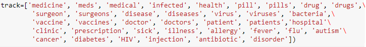
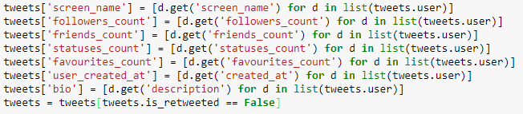
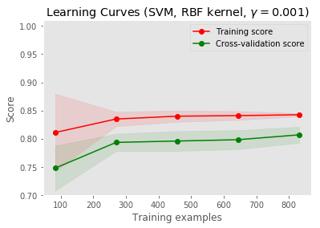
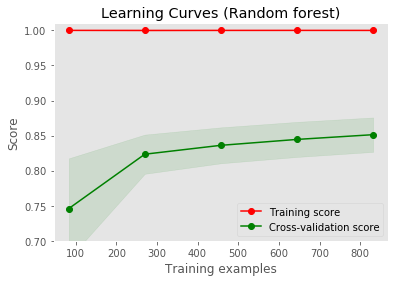

# A Twitter Healthcare Expert Finder and Analysis Tool

## Overview

An intelligent system designed to identify and classify medical experts on Twitter. With the vast number of professionals and influencers on the platform, our solution brings clarity by distinguishing true medical experts from the crowd.

### Features

- **Data Extraction**: Leveraging Twitter's API to process over 10,000 tweets daily.
- **Tweet Classification**: Advanced NLP techniques ensure accurate categorization of tweets.
- **Real-time Analytics**: Integrated dashboard for tracking and analyzing expert engagement.

## Keyword Tracking

This image displays a list of keywords used for tracking purposes in a text analysis project. The list includes medically related terms such as 'medicine', 'health', 'vaccine', and 'disease', among others. These keywords may be used to filter or collect data from various sources for further analysis in public health monitoring or related research fields.

## Feature Extraction from Tweets

Here we show a Python code snippet used for extracting features from tweets. It includes the extraction of various attributes such as 'screen_name', 'followers_count', 'friends_count', and more. The final line of code filters out retweeted messages, ensuring that only original tweets are included in the analysis. This code is part of a larger process of data preprocessing for social media analytics or sentiment analysis.

## Learning Curves

### SVM with RBF Kernel

This graph represents the learning curves for a Support Vector Machine (SVM) with an RBF kernel. The red line indicates the training score, while the green line represents the cross-validation score, both plotted against the number of training examples. The parameter gamma is set to 0.001. Notice how the training score remains relatively high as more data is added, suggesting that the model may benefit from more training data to improve cross-validation performance.

### Random Forest

The learning curves for a Random Forest classifier are depicted here. As with the SVM, the red line shows the training score, and the green line shows the cross-validation score. The graph illustrates that as more training examples are provided, the training score decreases slightly, while the cross-validation score increases, indicating good generalization as the model is exposed to more data.

## Technical Specifications

### Technologies Used

- **Data Processing**: Python, Pandas
- **Machine Learning**: Scikit-Learn
- **Twitter Data Extraction**: Tweepy
- **Web Application**: Flask

### Classification Accuracy

Achieved a tweet classification accuracy of 92% after rigorous testing and validation.

